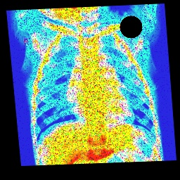

# Automated Medical X-Ray Image Enhancement

## Project Overview

This project aims to enhance X-ray images using advanced image processing techniques to improve the accuracy of a pre-trained pneumonia classifier. The classifier's initial accuracy of 55% is improved to a targeted 95% or higher by addressing various image quality issues, including noise, warping, contrast/brightness imbalance, and missing regions.

## Project Structure

- **main.py**: The main script that processes the X-ray images using various enhancement techniques and saves the results.
- **evaluation.py**: A script to evaluate the enhanced images by calculating metrics like Signal-to-Noise Ratio (SNR), edge sharpness, and contrast.
- **classify.py**: A script to run the pre-trained classifier on the enhanced images and report the accuracy.
- **classifier.model**: The pre-trained model used by `classify.py` to classify the X-ray images.
- **xray_images/**: The directory containing the original X-ray images (not included in this repository).

## Image Processing Techniques

The `main.py` script applies the following techniques to enhance the X-ray images:

1. **Unsharp Masking**: Enhances edges by reducing blurriness.
2. **Noise Estimation and Adaptive Denoising**: Estimates noise level using the Median Absolute Deviation (MAD) and applies Non-Local Means Denoising adaptively.
3. **Geometric Corrections**: Corrects tilt and warping using affine and perspective transformations.
4. **Removing Black Boundaries**: Detects and crops black boundaries to focus on the relevant image content.
5. **Contrast and Brightness Adjustments**: Enhances local contrast using CLAHE to maintain low-light details.
6. **Filling Black Spots**: Uses inpainting techniques to fill missing regions and enhance color intensity.

### Example Images

Below are examples of the original and enhanced images:

#### Original Image


#### Enhanced Image


## Usage

### Prerequisites

- Python 3.9 or higher
- OpenCV 4.8.0 or higher

### Installation

1. Clone the repository:

    ```bash
    git clone https://github.com/AbdulRehmanRattu/Automated-Medical-X-Ray-Image-Enhancement.git
    cd Automated-Medical-X-Ray-Image-Enhancement
    ```

2. Install the required packages:

    ```bash
    pip install opencv-python opencv-contrib-python numpy
    ```

### Running the Image Enhancement

To enhance the X-ray images, run the following command:

```bash
python main.py xray_images/
```

This will process all the images in the `xray_images/` directory and save the enhanced images in a new directory called `Results`.

### Evaluating the Enhanced Images

After processing the images, you can evaluate them using the `evaluation.py` script:

```bash
python evaluation.py
```

This script will calculate and display the average SNR, edge sharpness, and contrast for the enhanced images.

### Classifying the Enhanced Images

Finally, you can classify the enhanced images using the pre-trained classifier:

```bash
python classify.py --data=Results --model=classifier.model
```

This will output the classification results for each image and the overall accuracy.

## Detailed Code Explanation

### main.py

- **unsharp_mask(image)**: Enhances edges by applying an unsharp mask.
- **estimate_noise(image)**: Estimates the noise level in the image using the Median Absolute Deviation.
- **adaptive_denoise(image)**: Denoises the image adaptively based on the estimated noise level.
- **correct_tilt(image)**: Corrects the tilt in the image using affine transformation.
- **remove_black_boundaries(image)**: Crops out black boundaries to focus on the main content.
- **adjust_contrast_brightness(image)**: Enhances contrast and brightness using CLAHE.
- **correct_warping(image)**: Corrects perspective distortions in the image.
- **fill_black_spots(image)**: Fills in missing regions using inpainting techniques.
- **process_images(image_dir, output_dir)**: Processes all images in a directory and saves the enhanced versions.

### evaluation.py

- **compute_snr(original_image, denoised_image)**: Computes the Signal-to-Noise Ratio (SNR) between the original and denoised images.
- **measure_edge_sharpness(image)**: Measures the sharpness of edges in the image using the Laplacian method.
- **michelson_contrast(image)**: Computes the Michelson contrast for the image.
- **process_images(original_dir, result_dir)**: Processes and evaluates the images, calculating average SNR, sharpness, and contrast.

### classify.py

- Loads the pre-trained model from `classifier.model`.
- Processes images in the `Results` directory to classify them as "healthy" or "pneumonia".
- Reports the overall accuracy of the classification.

## Conclusion

This project demonstrates the use of conventional image processing techniques to significantly enhance the quality of X-ray images, leading to improved performance of a pre-trained classifier. The scripts provided are designed to be adaptable and can be used to process other similar datasets or extended for more complex image processing tasks.

## License

This project is licensed under the LGPL License - see the [LICENSE](http://www.gnu.org/licenses/lgpl.html) file for details.
